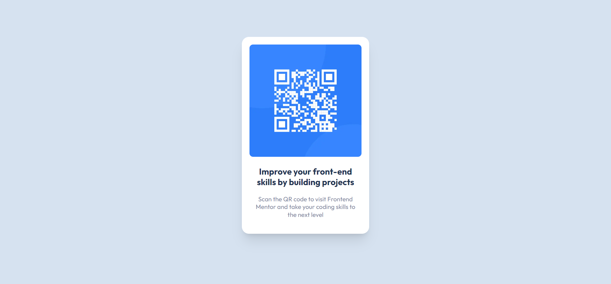
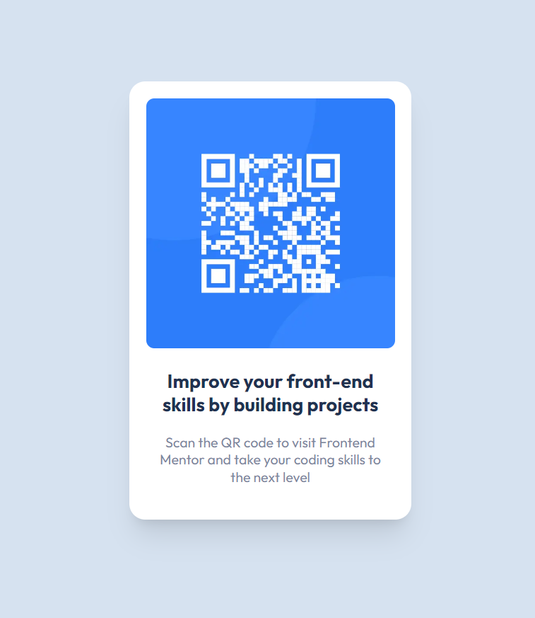

# Frontend Mentor - QR code component solution

This is a solution to the [QR code component challenge on Frontend Mentor](https://www.frontendmentor.io/challenges/qr-code-component-iux_sIO_H). Frontend Mentor challenges help you improve your coding skills by building realistic projects.

## Table of contents

- [Overview](#overview)
  - [Screenshot](#screenshot)
  - [Links](#links)
- [My process](#my-process)
  - [Built with](#built-with)
- [Author](#author)

## Overview

### Screenshot

### Links

- Live Site URL: [https://qr-component-ochre.vercel.app/](https://qr-component-ochre.vercel.app/)

## My process

### Built with

- CSS custom properties
- [Next.js](https://nextjs.org/) - React framework

## Author

- Name - Pratik Bhangire
- Frontend Mentor - [@pratikbhangire123](https://www.frontendmentor.io/profile/pratikbhangire123)
- Twitter - [@PratikBhangire](https://www.twitter.com/PratikBhangire)
